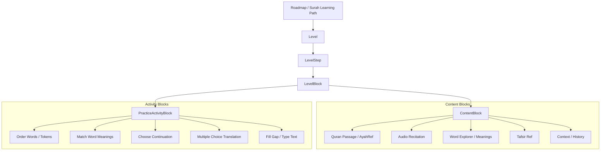
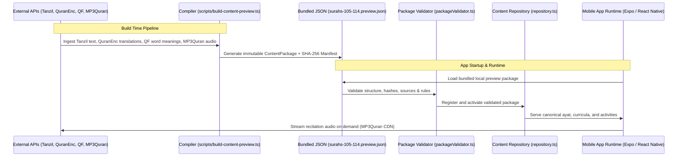

# Furqan Codebase & Architecture Report

> **Project**: Furqan (Mobile Quran Learning & Memorization App)  
> **Repository**: `BarBaRoSa1337/Al_Furqan` (`quran_do`)  
> **Stack**: React Native, Expo 54, Expo Router, Strict TypeScript, Jest, Expo-Audio  
> **Status**: 100% Type-Safe (0 errors), 39 Test Suites (176 tests passing)

---

## 1. Executive Summary

Furqan is a calm, source-governed, mobile-first Quran learning application built for Muslims (aged 12+, adults, and families) to establish a daily Quran habit. The learning methodology follows a memorization-first sequence:

$$\text{Roadmap} \longrightarrow \text{Discover Surah} \longrightarrow \text{Ayah Study} \longrightarrow \text{Active Recall} \longrightarrow \text{Comprehension Practice} \longrightarrow \text{Surah Review}$$

The application strictly adheres to the **Hafs ʿan ʿAsim** recitation standard, decouples canonical Quran data from lesson code, strictly validates Islamic sources with provenance hashes, and operates entirely offline via pre-compiled, versioned content packages.

---

## 2. Codebase Structure & Directory Layout

```text
quran_do/
├── packages/
│   ├── api-contracts/         # Shared schemas, DTOs, locale definitions, and API response types
│   │   └── src/index.ts       # SupportedLocale, ContentMode, LearnerPreferences, SourceAttribution
│   └── content-preview/       # Offline content ingestion & compiler engine
│       ├── source-inputs/     # Raw provider files (Tanzil, QuranEnc, Quran.Foundation, MP3Quran)
│       ├── generated/         # Pre-compiled bundles (packages.json, manifest.json, sha256)
│       └── src/importer.ts    # Content transformer: turns raw provider data into ContentPackage
├── src/
│   ├── app/                   # Expo Router navigation routes
│   │   ├── _layout.tsx        # App bootstrap, font loading, package loader & error boundary
│   │   ├── index.tsx          # Home dashboard (daily streak, progress rings, review cards)
│   │   ├── roadmap.tsx        # Visual Surah progression roadmap
│   │   ├── surah/[id].tsx     # Surah curriculum level list (Intro -> Ayat -> Final Review)
│   │   ├── level/[id].tsx     # Level entry modal (overview, duration, requirements)
│   │   ├── lesson/[id].tsx    # Active learning session loop
│   │   └── complete/[id].tsx  # Level completion celebration & receipt summary
│   ├── components/
│   │   ├── furqan/            # Core shell components (FurqanHeader, BottomNavigation, Indicators)
│   │   ├── lesson/            # Active lesson engine & block renderers
│   │   │   ├── DailyLearningLoop.tsx       # Step runner, progress bar, top/bottom navigation
│   │   │   ├── StepRenderer.tsx            # Routes step to standard or unified renderers
│   │   │   ├── UnifiedAyahStudyRenderer.tsx # Quran Paper card (Ayah + Audio + Translit + Tabs)
│   │   │   ├── LevelBlockRenderer.tsx      # Fallback renderer for individual block types
│   │   │   ├── AyahAudioPlayer.tsx         # Minimal audio player with repeat, speed, and scrub
│   │   │   ├── LearningActivityRenderer.tsx # Interactive activities (order, match, fill, choose)
│   │   │   └── WisdomCard.tsx              # Reflection and summary card
│   │   ├── roadmap/           # Roadmap nodes, connectors, and Surah progress rings
│   │   └── ui/                # Base design system (Button, Card, ProgressBar, Screen)
│   ├── lib/
│   │   ├── activities/        # Activity validation and evaluation engine (pure functions)
│   │   ├── audio/             # Recitation policy, caching (web vs native), and SHA-256 checks
│   │   ├── content/           # Content repository, validator, governance, and local preview provider
│   │   ├── localization/      # Translation catalogs, preferences state, and RTL management
│   │   └── progress/          # Learner attempt tracking, level resume state, and review queue (SRS)
│   ├── content/
│   │   ├── local-preview/     # Bundled JSON packages for offline preview (Surahs 105-114)
│   │   └── packages/          # Built-in fallback packages
│   └── types/                 # Domain types (content, activities, progress, media, governance)
├── scripts/                   # Build, fetch, and validation CLI scripts
│   ├── build-content-preview.ts    # Compiles raw source inputs into local preview JSON
│   ├── validate-content-preview.ts # Validates generated bundles against strict governance rules
│   └── fetch-quranenc-preview.ts   # Upstream fetcher for translation evidence
└── docs/                      # Architectural specifications, governance rules, and plans
```

---

## 3. Core Hierarchy & Architecture



### Hierarchy Breakdown:
1. **Roadmap (`LearningPath`)**: Manages the overarching progression of Surahs and curricula.
2. **Surah (`SurahRecord`)**: Canonical Surah metadata (number, name, ayah count, revelation type).
3. **Level (`Level`)**: An indivisible unit of learning (e.g. *Discover Surah*, *Ayah 1*, *Surah Review*).
4. **Step (`LevelStep`)**: Sequential phases within a level (e.g., `read` $\to$ `memory_practice` $\to$ `understanding_practice`).
5. **Block (`LevelBlock`)**: Modular UI items rendered inside a step (Ayah text, Audio, Translation, Activity).
6. **Activity (`LearningActivity`)**: Pure schema-driven interactive exercise with deterministic evaluation.

---

## 4. How the Application Behaves & Uses APIs

The application uses a **dual-pipeline model**: data is retrieved and compiled at **build time**, while the runtime operates in **immutable offline mode** (or through a runtime package server).



### 4.1 External APIs & Upstream Data Sources
| Provider | Resource | Usage | Offline Strategy |
| :--- | :--- | :--- | :--- |
| **Tanzil Project** | Uthmani Hafs Quran Text (`v1.1`) | Canonical Arabic text and word tokenization | Bundled in package JSON |
| **QuranEnc** | `english_rwwad` & `french_rashid` | Verified translations & footnotes | Bundled in package JSON |
| **Quran Foundation (Quran.com API v4)** | Word-by-word endpoints & Tafsir `169` | Arabic word tokens, transliterations, word meanings, English Tafsir Ibn Kathir | Bundled in package JSON |
| **MP3Quran.net** | Mahmoud Khalil Al-Husary recitation | Ayah audio streaming with millisecond timestamp markers | Direct streaming via CDN (`stream_only`) with local segment caching |

### 4.2 Runtime Content Loading Flow
1. **Bootstrap (`_layout.tsx`)**: Resolves `EXPO_PUBLIC_FURQAN_CONTENT_MODE` (`preview` vs `production`).
2. **Local Preview Mode**: Loads `src/content/local-preview/surahs-105-114.preview.json`, verifies its SHA-256 payload digest, and validates all 10 Surahs through `validatePackage()`.
3. **Activation**: The `ContentRepositoryImpl` indexes all surahs, ayat, word tokens, translations, and levels into fast in-memory lookup maps.
4. **Session Controller (`useLevelSession.ts`)**:
   - Manages the active step index.
   - Evaluates activity submissions instantly inline.
   - Writes completion receipts and attempt logs to the persistent SQLite storage layer.

---

## 5. Recent Changes & Upgrades

The following major upgrades and fixes have been implemented, tested, and pushed:

### 1. Unified "Quran Paper" Ayah Study Screen (`UnifiedAyahStudyRenderer.tsx`)
- **Problem**: Previously, studying an Ayah was fragmented across 4 separate screens (*Listen/Read* $\to$ *Translation* $\to$ *Word Meaning* $\to$ *Tafsir*), requiring excessive "Continue" button taps.
- **Solution**: Consolidated all 4 blocks into a single elegant card with warm Quran-paper styling (`#FDFBF7`), displaying the Arabic text, minimal inline audio player, transliteration, and translation together, with clean top tabs for **Words** and **Tafsir**.

### 2. Dynamic Exercise Rotation (`importer.ts`)
- **Problem**: Every Ayah level repeated the exact same multiple-choice translation question.
- **Solution**: Implemented an intelligent rotation engine:
  - **`match_word_meaning`**: For odd-numbered ayat with word-by-word data, matches 2–3 Arabic words to their English definitions.
  - **`choose_continuation`**: For even-numbered ayat (≥ 4 tokens), prompts the beginning of the ayah and asks the learner to choose the correct continuing word.
  - **`multiple_choice`**: Translation identification with plausible distractors from the same Surah.

### 3. English Tafsir Integration (Ibn Kathir / QF Provider `169`)
- **Problem**: Tafsir entries were previously defaulting to Arabic Al-Muyassar (Provider `16`), which was unhelpful for English learners.
- **Solution**: Re-pointed the data pipeline to fetch and compile Tafsir Ibn Kathir (English, Provider `169`), correctly tagged to the English lesson locale.

### 4. Audio Player Enhancements (`AyahAudioPlayer.tsx`)
- Added a **playback speed toggle** (`1.0×` ↔ `0.75×`) for slower recitation during memorization.
- Added repeat modes (`1×`, `3×`, `5×`) with loop counters.
- Added autoplay recovery handling for mobile web/native.

### 5. Package Validator & Preview Activation Fix (`packageValidator.ts`)
- Fixed a strict validation rule in `packageValidator.ts` that rejected `word_explorer` and `tafsir_ref` blocks within `read` steps, which was causing the app to silently fall back to the old hardcoded single-surah package. All 10 Surahs (105–114) now validate and load seamlessly.

### 6. Surah Introduction Context Enrichment (`importer.ts`)
- Authored thematic and historical context summaries for all 10 Surahs (105 to 114) in their discovery levels.

---

## 6. Current Issues, Constraints & Technical Debt

### 6.1 Content Governance in Development vs Production
- **Current State**: Sources and packages currently carry `reviewerStatus: 'draft'`. In `preview` mode, draft content is permitted and rendered with visible `DRAFT` badges.
- **Constraint**: To release a true `production` build (`EXPO_PUBLIC_FURQAN_CONTENT_MODE=production`), formal editorial, scholarly (shaykh), and legal license attestations must be attached to the package governance manifest.

### 6.2 Legacy `question` Blocks vs Schema v4 `activity` Blocks
- **Current State**: The codebase maintains two quiz engines: the legacy `question` block (in `src/components/quiz/`) and the modern `LearningActivityRenderer` (in `src/components/lesson/`).
- **Debt**: Generated packages exclusively use the modern `activity` schema, but legacy question components remain for backward compatibility. These can eventually be phased out.

### 6.3 Audio Caching & Offline Media Limits
- **Current State**: Audio is configured as `stream_only` to comply with MP3Quran provider terms of use.
- **Constraint**: Recitations stream on-demand from the CDN rather than being pre-bundled into the app binary, requiring an active internet connection for audio playback unless cached during the active session.

### 6.4 Client Session Invalidation on Schema Migrations
- **Current State**: When step IDs are merged or modified in content packages, users with an existing SQLite session snapshot may see stale step sequences unless they tap "Start Over".
- **Mitigation**: A session versioning check in `levelResume.ts` should auto-reset sessions if the loaded step IDs no longer match the stored attempt IDs.

---

## 7. Verification & Test Metrics

| Test Suite | Total Files | Passed | Status |
| :--- | :--- | :--- | :--- |
| **Jest Test Suites** | 39 suites | 39 passed (176 tests) | 🟢 100% Pass |
| **TypeScript Typecheck** | Entire monorepo | 0 errors | 🟢 Strict Mode |
| **Content Package Validator** | 10 Surahs (48 Ayat, 68 Nodes) | 0 errors | 🟢 Validated |

---

## 8. Summary & Recommended Next Milestones

1. **Client Migration Guard**: Automatically reset stored session progress when a level's step configuration changes to avoid manual "Start Over" requirements.
2. **Audio Offline Cache Persistence**: Obtain formal written permission from audio providers to enable verified offline MP3 caching for downloaded Surahs.
3. **Surah Scope Expansion**: Extend the ingestion pipeline beyond Surahs 105–114 to encompass the entirety of Juz 30 (Surahs 78–114).
