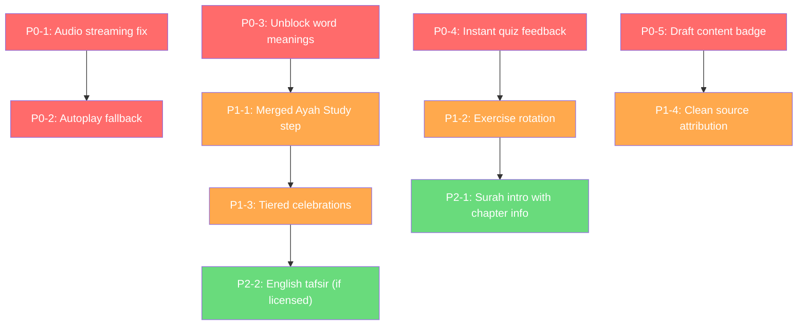

# Furqan — Detailed Improvement Plan

> **Status**: Plan only. No code changes.
> **Scope**: Full repo inspection complete. Root causes identified for all reported issues. Implementation tickets organized by priority.

---

## Table of Contents

1. [Current Architecture Summary](#1-current-architecture-summary)
2. [Root Cause Analysis](#2-root-cause-analysis)
3. [P0 — Critical Bug Fixes](#3-p0--critical-bug-fixes)
4. [P1 — UX Consolidation](#4-p1--ux-consolidation)
5. [P2 — Content Expansion & Polish](#5-p2--content-expansion--polish)
6. [Quiz Validation Overhaul](#6-quiz-validation-overhaul)
7. [Block Architecture Summary](#7-block-architecture-summary)
8. [Risk Register](#8-risk-register)
9. [Non-Goals (Confirmed)](#9-non-goals-confirmed)

---

## 1. Current Architecture Summary

```text
Roadmap Screen (/roadmap)
  └─► Surah Learning Path (/surah/[id])
       └─► Level Entry Modal (/level/[id])
            └─► Active Lesson Player (/lesson/[id])
                 ├── DailyLearningLoop (top bar + scroll + footer)
                 │    └── StepRenderer (title + blocks[])
                 │         └── LevelBlockRenderer (switch on block.type)
                 │              ├── CanonicalAyahBlock
                 │              ├── CanonicalPassageBlock
                 │              ├── CanonicalTranslationBlock
                 │              ├── CanonicalTafsirBlock
                 │              ├── AyahAudioPlayer
                 │              ├── WordExplorerBlock
                 │              ├── PracticeActivityRenderer
                 │              │    ├── RecallThenRevealActivity
                 │              │    └── LearningActivityRenderer
                 │              ├── LevelQuestionBlock (legacy)
                 │              └── WisdomCard
                 └─► Completion Screen (/complete/[id])
```

### Current Step Flow per Ayah Level (importer)

```
1. Read step       → ayah_ref + audio block (2 blocks)
2. Translation     → translation block (1 block)
3. Word Meaning    → word_explorer OR source_locked (1 block)
4. Tafsir          → tafsir_ref OR source_locked (1 block)
5. Memory Practice → order_tokens/order_segments activity (1 block)
6. Understanding   → multiple_choice activity (1 block)
7. Extra Gap       → fill_gap activity (optional, 1 block)
8. Extra Type      → type_missing_text (optional, 1 block)
```

**This produces 6 required Continue presses per ayah** (steps 1–6 each need Continue or auto-advance).

---

## 2. Root Cause Analysis

### 2.1 Audio Fails in Some Lessons

**Root cause**: In [AyahAudioPlayer.tsx](file:///home/barbarosa/quran_do/src/components/lesson/AyahAudioPlayer.tsx), audio resolution depends on `resolveAudioAccessPolicy()`. In production mode (`isPreviewContentMode() === false`), the policy returns `mode: 'blocked'` when no `LicenseGrant` attestation covers the track. The MP3Quran grant template has `permissionStatus: 'pending'` in [grantTemplates.ts](file:///home/barbarosa/quran_do/src/content/governance/grantTemplates.ts).

**Secondary cause**: On web (Expo Go web), browser autoplay policies block `player.play()`. The player catches the error silently (line 93 `catch {}`) but shows no user-facing message explaining why audio didn't start.

**Resolution**: [P0-1] Ensure preview mode always allows streaming. [P0-2] Show a tap-to-play fallback when autoplay is blocked.

---

### 2.2 Word Meaning Blocked ("source-locked")

**Root cause**: In [importer.ts L375-377](file:///home/barbarosa/quran_do/packages/content-preview/src/importer.ts#L375-L377), word meanings are only rendered when `ayah.wordMeanings.length === tokenIds.length`. If word-meaning data is partial or missing for any token in the ayah, the entire step falls back to a `source_locked` block with `reason: 'credentials_required'`.

The preview importer fetches word-by-word data from `quran.com/api/v4/verses/by_key/:key?words=true` but the API may return fewer meanings than tokens for some ayat (e.g., when the endpoint omits basmala words or end-of-ayah markers).

**Resolution**: [P0-3] Relax the equality check — show available word meanings even if partial. Remove the all-or-nothing gate.

---

### 2.3 Too Many Continue Presses

**Root cause**: The importer generates **6 required steps** per ayah (read, translation, word_meaning, tafsir, memory, understanding). Each non-interactive step requires a manual Continue tap. For a 5-ayah surah, a learner presses Continue ~30 times just for content steps before any practice.

The `DailyLearningLoop` shows a footer `Button` for every step where `hasInteraction === false`, which is all informational steps.

**Resolution**: [P1-1] Consolidate informational blocks into fewer steps, specifically the "Ayah Study" merged screen.

---

### 2.4 Translation Separated from Ayah Unnecessarily

**Root cause**: The importer creates separate steps for `read` (ayah_ref + audio) and `translation` (translation block). These are two distinct steps requiring two Continue presses, even though the `CanonicalAyahBlock` already shows the translation inline when `block.translationLocale` is set.

**Resolution**: [P1-1] Merge translation into the ayah_ref step. Remove the standalone translation step.

---

### 2.5 Quizzes Use "answer → Check → Continue"

**Root cause**: The **legacy `question` block type** uses `LevelQuestionBlock → MultipleChoiceQuestion` ([MultipleChoiceQuestion.tsx](file:///home/barbarosa/quran_do/src/components/quiz/MultipleChoiceQuestion.tsx)). This component selects an answer and immediately submits via `onResult()`. However, the session hook then sets `feedback` and schedules auto-advance after 700ms/400ms. The user sees: ① tap answer → ② green/red highlight → ③ feedback banner → ④ 700ms wait → ⑤ auto-advance. This feels like "answer → Check → Continue" because of the banner + delay.

For **activity blocks**, the same pattern applies: `LearningActivityRenderer` submits the answer, the session shows feedback, and auto-advances after a timer.

**Resolution**: [P0-4] Implement instant visual feedback on the choice itself (green + haptic or red + shake) and auto-advance in ≤500ms for single-choice exercises. No separate banner for single-answer activities.

---

### 2.6 Translation Matching Repeated Too Much

**Root cause**: Every ayah level generates a `match_ayah_translation` or `multiple_choice` understanding exercise. In the surah review level, there's another `match_ayah_translation` activity covering all ayat. For a 5-ayah surah: 5 per-ayah matching + 1 review matching = 6 translation-matching exercises.

**Resolution**: [P1-2] Rotate exercise types. Per-ayah understanding exercises should vary between `multiple_choice`, `choose_continuation`, `fill_gap`, and `match_word_meaning`. Reserve `match_ayah_translation` for review levels only.

---

### 2.7 Full Celebration Too Frequent

**Root cause**: The [completion screen](file:///home/barbarosa/quran_do/src/app/complete/%5Bid%5D.tsx) fires confetti for **every** first-time level completion (`!receipt.alreadyCompleted`). With 7 levels per surah (intro + 5 ayat + review), a learner sees confetti 7 times per surah.

**Resolution**: [P1-3] Reserve confetti + full celebration for surah-level completions or milestone levels (`metadata.isFinalReview === true`). For regular ayah levels, show a simpler "well done" transition (haptic + green checkmark + auto-navigate to next level in 1.5s).

---

### 2.8 Unsupported/Draft Tafsir May Appear

**Root cause**: In [contentEligibility.ts](file:///home/barbarosa/quran_do/src/lib/content/contentEligibility.ts), `isBlockEligibleForProduction()` correctly filters tafsir with `reviewerStatus !== 'approved'` in production mode. However, in **preview mode** (`isPreviewContentMode() === true`), the eligibility check is **bypassed entirely** (line 43: `if (!isPreviewContentMode() && ...)`). This means draft tafsir entries render without any visual distinction in the preview build.

**Resolution**: [P0-5] In preview mode, show a visible "DRAFT" badge on content with `reviewerStatus !== 'approved'`. Never show content with `reviewerStatus === 'draft'` silently.

---

### 2.9 Unsupported Reflections/Wisdom May Appear

**Root cause**: Same as 2.8. `WisdomCard` renders the share button only for `approved` blocks, but the card itself still renders in preview mode regardless of review status. The summary block in the review level is a `source_locked` placeholder, so this is safe for generated content. But the hardcoded `surah-al-fil/v1.ts` package may contain summary blocks with `reviewerStatus: 'draft'`.

**Resolution**: [P0-5] Same fix — DRAFT badge on all governed blocks in preview mode.

---

### 2.10 Surah Intro/Context Weak

**Root cause**: The importer creates a one-step introduction level containing only a `surah_overview` block (surah number, names, ayah count, revelation place). No historical context, occasion of revelation, or chapter information is generated.

The server's `runtimeCourse.ts` fetches chapter info from QF (`QF_CHAPTER_INFO_RESOURCE_ID`), but the content-preview importer does **not** fetch or include it.

**Resolution**: [P2-1] Fetch and include chapter information from QF in the preview importer. Render it as a `context` block in the surah introduction level.

---

### 2.11 Source Display Ugly/Too Technical

**Root cause**: [CanonicalAyahBlock](file:///home/barbarosa/quran_do/src/components/lesson/LevelBlockRenderer.tsx#L167-L187) renders full source attribution with labels like "ARABIC SOURCE", "TRANSLATION SOURCE", version strings (`v1.0.19`), and raw URLs below every ayah. This is developer-oriented metadata, not user-friendly attribution.

**Resolution**: [P1-4] Collapse source attribution into a subtle collapsible "i" (info) icon or a "Sources" link at the bottom of the card, not inline with every block.

---

### 2.12 Lesson Flow Too Fragmented

**Root cause**: The combination of 2.3 (too many steps), 2.4 (translation separate), 2.6 (repeated matching), and 2.7 (too many celebrations) creates a fragmented feel. The core UX issues compound.

**Resolution**: Addressed holistically across [P1-1] through [P1-4].

---

## 3. P0 — Critical Bug Fixes

### P0-1: Audio Streaming in Preview Mode

> [!IMPORTANT]
> Audio fails silently when policy returns `blocked`. Preview mode should always allow streaming.

**Files to modify**:
- [audioPolicy.ts](file:///home/barbarosa/quran_do/src/lib/audio/audioPolicy.ts) — `resolveAudioAccessPolicy()` already has the `development` fallback (line 26), but it relies on the caller passing `{ development: isPreviewContentMode() }`. Verify this is consistently passed.
- [AyahAudioPlayer.tsx](file:///home/barbarosa/quran_do/src/components/lesson/AyahAudioPlayer.tsx) — Line 60: `{ development: isPreviewContentMode() }` is already passed. Root cause is likely the `mode: 'blocked'` result not being handled gracefully in the UI.

**Changes**:
1. When `resolution.status === 'unavailable'`, show a clear message: "Audio requires an internet connection" instead of silently rendering nothing.
2. When `mode: 'stream'` and autoplay is blocked by the browser, detect `player.play()` failure and show a visible "Tap to play" button instead of the silent `catch {}`.

**Tests**: Add a test in `AyahAudioPlayer` verifying the unavailable message renders.

---

### P0-2: Autoplay Fallback for Web

**Files to modify**:
- [AyahAudioPlayer.tsx L91-96](file:///home/barbarosa/quran_do/src/components/lesson/AyahAudioPlayer.tsx#L91-L96)

**Changes**:
1. Track autoplay failure state: `const [autoplayBlocked, setAutoplayBlocked] = useState(false)`.
2. In the `catch` block (L93), set `setAutoplayBlocked(true)`.
3. When `autoplayBlocked && !status.playing`, show a pulsing "Tap to play ▶" overlay on the play button.

---

### P0-3: Unblock Word Meanings (Partial Data)

**Files to modify**:
- [importer.ts L375-377](file:///home/barbarosa/quran_do/packages/content-preview/src/importer.ts#L375-L377)

**Changes**:
1. Change the equality gate from:
   ```ts
   ayah.wordMeanings && ayah.wordMeanings.length === tokenIds.length
   ```
   to:
   ```ts
   ayah.wordMeanings && ayah.wordMeanings.length > 0
   ```
2. The `WordExplorerBlock` already gracefully handles partial data (it renders only available meanings).

**Tests**: Update `importer.test.ts` to verify word_explorer block is generated with partial meanings.

---

### P0-4: Instant Quiz Feedback

**Files to modify**:
- [useLevelSession.ts L159-167](file:///home/barbarosa/quran_do/src/hooks/useLevelSession.ts#L159-L167) — `scheduleAutomaticAdvance`
- [DailyLearningLoop.tsx L100-105](file:///home/barbarosa/quran_do/src/components/lesson/DailyLearningLoop.tsx#L100-L105) — Feedback banner

**Changes**:
1. Reduce auto-advance delay: `700ms → 500ms` for correct, `400ms → 300ms` for incorrect on retry steps.
2. For single-choice activities (`multiple_choice`, `choose_continuation`): the visual feedback is already inline in the activity renderer (green/red borders + shake). Skip the `DailyLearningLoop` feedback banner for these — only show it for multi-step exercises.
3. Add `feedbackMode?: 'banner' | 'inline'` to `SessionFeedback`. Single-choice exercises get `'inline'`, multi-step exercises get `'banner'`.

---

### P0-5: Draft Content Badge in Preview Mode

**Files to modify**:
- [LevelBlockRenderer.tsx L39-83](file:///home/barbarosa/quran_do/src/components/lesson/LevelBlockRenderer.tsx#L39-L83) — main switch

**Changes**:
1. After the production eligibility check (L43), add preview-mode badge logic:
   ```ts
   const showDraftBadge = isPreviewContentMode() && hasDraftStatus(block);
   ```
2. Wrap governed block renders in a `DraftBadge` component showing a subtle amber "DRAFT — Not for production" label.
3. Apply to: `context`, `summary`, `tafsir_ref`, `word_meaning`, `word_explorer`, `activity`, `question`.

---

## 4. P1 — UX Consolidation

### P1-1: Ayah Study Consolidated Step

> [!IMPORTANT]
> This is the highest-impact UX change. Merge 4 separate informational steps into 1 scrollable "Ayah Study" step.

**Current**: 4 steps (read → translation → word_meaning → tafsir), 4 Continue presses.
**Target**: 1 step ("Study the Ayah"), 1 Continue press.

**Architecture**:

```text
Step: "Study Ayah X"
  ├── Block: ayah_ref (Arabic + transliteration + translation + audio autoplay)
  ├── Block: word_explorer (word meanings, if available)
  └── Block: tafsir_ref (Tafsir Al-Muyassar, collapsible)
```

**Files to modify**:
- [importer.ts `buildCurriculum()`](file:///home/barbarosa/quran_do/packages/content-preview/src/importer.ts#L349-L422) — Merge steps 1-4 into a single step with multiple blocks. The step `kind` stays `'read'` (it's the primary content consumption step).

**Specifically**:
```ts
// BEFORE: 4 separate steps
steps: [
  { id: `${id}-read`, kind: 'read', blocks: [ayah_ref, audio] },
  { id: `${id}-translation`, kind: 'translation', blocks: [translation_block] },
  { id: `${id}-word-meaning`, kind: 'word_meaning', blocks: [word_explorer_or_locked] },
  { id: `${id}-tafsir`, kind: 'tafsir', blocks: [tafsir_ref_or_locked] },
  ...practice steps
]

// AFTER: 1 merged step + practice steps
steps: [
  { id: `${id}-study`, kind: 'read', title: 'Study Ayah X', blocks: [
    ayah_ref_block,      // Arabic + transliteration + translation
    audio_block,         // Autoplay audio player
    word_explorer_block, // Word meanings (if available, not source_locked)
    tafsir_ref_block,    // Tafsir (if available, not source_locked)
  ] },
  ...practice steps
]
```

**Key decisions**:
- `source_locked` blocks for word_meaning and tafsir are **omitted** from the merged step (they add clutter for missing content). Instead, these sections simply don't appear.
- The step is scrollable — Arabic at top, audio auto-plays, user scrolls down through meaning and tafsir at their own pace.
- The `required` flag on the merged step stays `true` (it's the core content consumption step).

**Impact on step count**: From 6 required steps per ayah → 3 (study, memory, understanding). Reduces Continue presses by 50%.

**Backward compatibility**: Progress migration needed — existing users with partial step completion need their progress mapped from old step IDs to new.

---

### P1-2: Exercise Type Rotation

**Files to modify**:
- [importer.ts `buildCurriculum()`](file:///home/barbarosa/quran_do/packages/content-preview/src/importer.ts#L349-L422)

**Changes**:
1. Define an exercise rotation array:
   ```ts
   const understandingExercises = [
     'multiple_choice',
     'choose_continuation',
     'fill_gap',
     'match_word_meaning',
   ] as const;
   ```
2. For each ayah level, pick the exercise type by `ayahNumber % understandingExercises.length`.
3. Reserve `match_ayah_translation` exclusively for the surah review level.

**Prerequisite**: `choose_continuation` and `match_word_meaning` require word tokens and word meanings. If unavailable, fall back to `multiple_choice`.

---

### P1-3: Tiered Completion Celebrations

**Files to modify**:
- [complete/[id].tsx](file:///home/barbarosa/quran_do/src/app/complete/%5Bid%5D.tsx)
- [useLevelSession.ts](file:///home/barbarosa/quran_do/src/hooks/useLevelSession.ts)

**Changes**:

1. **Full celebration** (confetti + "Alhamdulillah" + stats card):
   - Only for `level.metadata?.isFinalReview === true` (surah review completion).
   - Only for first-time completion (`!receipt.alreadyCompleted`).

2. **Simple transition** (for regular ayah levels):
   - Show inline "✓ Ayah X complete" success banner in `DailyLearningLoop` for 1.5 seconds.
   - Auto-navigate to the next level without going through the full completion screen.
   - Alternatively: show a minimal completion card (green checkmark, +XP, "Next Ayah →" button) directly in the lesson player.

3. **Introduction level completion**:
   - Skip the completion screen entirely — auto-advance to Ayah 1 level.

---

### P1-4: Clean Source Attribution

**Files to modify**:
- [LevelBlockRenderer.tsx](file:///home/barbarosa/quran_do/src/components/lesson/LevelBlockRenderer.tsx) — `CanonicalAyahBlock`, `CanonicalTafsirBlock`, `CanonicalTranslationBlock`

**Changes**:
1. Remove inline source attribution from `CanonicalAyahBlock` (lines 179-184).
2. Add a small "ⓘ" info icon in the top-right corner of the card.
3. Pressing "ⓘ" expands a collapsible section showing source names (no URLs, no version strings).
4. Full attribution (with URLs and versions) remains on the [Attributions screen](file:///home/barbarosa/quran_do/src/app/attributions.tsx).
5. For tafsir blocks, show only the source name after the text (e.g., "— Tafsir Al-Muyassar"), not the full source card.

---

## 5. P2 — Content Expansion & Polish

### P2-1: Surah Introduction with Chapter Info

**Files to modify**:
- [fetch-quranenc-preview.ts](file:///home/barbarosa/quran_do/scripts/fetch-quranenc-preview.ts) — Add QF chapter info fetch.
- [importer.ts](file:///home/barbarosa/quran_do/packages/content-preview/src/importer.ts) — Parse chapter info and generate `context` blocks.

**Changes**:
1. Fetch chapter info from QF API (`/chapters/:id/info`) for each preview surah.
2. Save to `source-inputs/quranfoundation/chapter-info/`.
3. In `buildCurriculum()`, add a `context` block (kind: `'chapter_information'`) to the introduction level step after the `surah_overview` block.
4. Context text: surah background, themes, key messages (from QF chapter info).
5. `reviewerStatus: 'draft'` — this is provider content, not yet editorially reviewed.

---

### P2-2: English Tafsir Candidate (Al-Mukhtasar)

> [!WARNING]
> **License verification required before implementation.**
> QUL English Al-Mukhtasar via Quran.Foundation needs explicit license check.

**Investigation steps**:
1. Check QF resource catalog for Al-Mukhtasar English tafsir resource ID.
2. Verify the license terms via `listQuranFoundationResources.ts`.
3. If CC-compatible or has developer ToS coverage: proceed to integrate alongside Tafsir Al-Muyassar.
4. If restricted: document in `SOURCE_TERMS_REGISTRY.md` and defer.

**If approved**:
- Add `ENGLISH_TAFSIR_RESOURCE_ID` to constants.
- Fetch per-ayah English tafsir in preview importer.
- Store alongside Arabic Muyassar. The `tafsir_ref` block can reference either based on the learner's `lessonLocale`.

---

### P2-3: Lightweight Explanation Images

**Deferred** — requires:
1. Creative Commons or properly licensed image sources.
2. `MediaBlock` support is already implemented in `LevelBlockRenderer`.
3. Images must have alt text, source ID, and review status per `CONTENT_GOVERNANCE.md`.
4. No depictions of prophets, angels, or the unseen.

**When ready**: Add `media` blocks to context steps with `reviewerStatus: 'draft'`.

---

### P2-4: Approved Wisdom / Hidayat al-Quran

> [!CAUTION]
> **Do NOT scrape or use Hidayat al-Quran content until explicit written permission is confirmed.**

**Status**: Not available. Deferred.

---

## 6. Quiz Validation Overhaul

### Generic Validation Modes

Add a `validationMode` field to the activity schema:

```ts
type ValidationMode = 'instant_on_choice' | 'when_complete' | 'manual';
```

**Default mapping by activity kind**:

| Activity Kind | Default Validation Mode |
|---|---|
| `multiple_choice` | `instant_on_choice` |
| `choose_continuation` | `instant_on_choice` |
| `fill_gap` | `when_complete` |
| `order_tokens` / `order_segments` | `when_complete` |
| `order_ayat` | `when_complete` |
| `match_word_meaning` | `instant_on_choice` (per pair) |
| `match_ayah_translation` | `instant_on_choice` (per pair) |
| `type_missing_text` | `manual` (submit button) |
| `recall_then_reveal` | `manual` (self-rating) |

### Instant Feedback UX

**Single choice (`instant_on_choice`)**:
1. Tap option → immediate evaluation.
2. Correct → option turns green + haptic success → auto-advance in 500ms.
3. Incorrect → option turns red + shake animation → retry allowed (one more attempt), then queued for retry phase.

**Matching (`instant_on_choice` per pair)**:
1. Select prompt → select choice → immediate pair evaluation.
2. Correct → both turn green, match locks.
3. Incorrect → both flash red, reset selection.
4. When all pairs matched → auto-advance.

**Ordering (`when_complete`)**:
1. User builds sequence by tapping items.
2. When sequence length equals expected length → automatic evaluation.
3. Correct → all items flash green → auto-advance.
4. Incorrect → shake → user can remove items and retry.

### Files to modify
- [types/activities.ts](file:///home/barbarosa/quran_do/src/types/activities.ts) — Add `validationMode` to `ActivityBase`.
- [LearningActivityRenderer.tsx](file:///home/barbarosa/quran_do/src/components/lesson/LearningActivityRenderer.tsx) — Respect `validationMode` in each activity component.
- [useLevelSession.ts](file:///home/barbarosa/quran_do/src/hooks/useLevelSession.ts) — Differentiate feedback display by validation mode.
- [DailyLearningLoop.tsx](file:///home/barbarosa/quran_do/src/components/lesson/DailyLearningLoop.tsx) — Skip banner for `instant_on_choice` feedback.

---

## 7. Block Architecture Summary

### Current Block Types

| Block Type | Renderer | Used In |
|---|---|---|
| `surah_overview` | `CanonicalSurahOverviewBlock` | Introduction level |
| `quran_passage` | `CanonicalPassageBlock` | Review level |
| `ayah_ref` | `CanonicalAyahBlock` | Per-ayah read step |
| `translation` | `CanonicalTranslationBlock` | Per-ayah (to be merged) |
| `word_meaning` | `SelectedWordMeaningBlock` | Per-ayah (to be merged) |
| `word_explorer` | `WordExplorerBlock` | Per-ayah (to be merged) |
| `tafsir_ref` | `CanonicalTafsirBlock` | Per-ayah (to be merged) |
| `context` | `CanonicalContextBlock` | Introduction (to be expanded) |
| `audio` | `CanonicalAudioBlock` → `AyahAudioPlayer` | Per-ayah read step |
| `source_locked` | `SourceLockedCard` | Preview fallback |
| `media` | `CanonicalMediaBlock` | Not yet used in preview |
| `question` | `LevelQuestionBlock` | Legacy quizzes |
| `activity` | `PracticeActivityRenderer` | All exercises |
| `summary` | `WisdomCard` | Review level (locked) |

### Proposed Reusable Blocks (Future)

These are already supported by the type system; no new block types needed:

- **AyahStudyBlock** → Achieved by merging `ayah_ref` + `audio` + `word_explorer` + `tafsir_ref` into one step.
- **ContextBlock** → Already exists (`context` type with `ContextKind`).
- **TafsirBlock** → Already exists (`tafsir_ref` type).
- **GuidanceBlock** → Map to `summary` with variant `verified_recap`.
- **ImageBlock** → Already exists (`media` type).
- **QuestionBlock** → Already exists (`activity` type with `multiple_choice`).

---

## 8. Risk Register

| Risk | Severity | Mitigation |
|---|---|---|
| Progress migration for merged steps | Medium | Map old step IDs to new composite step ID. Add migration in `buildCurriculum()` `completionMigrations`. |
| English tafsir license unclear | Medium | Verify before implementing. Gate behind `reviewerStatus: 'draft'`. |
| Autoplay blocked on iOS Safari | Low | Already handled with `catch {}` — enhance with visible fallback. |
| Word meaning API returns fewer tokens than expected | Low | Fixed by P0-3 (relax equality check). |
| Breaking existing test assertions | Low | Update test expectations for merged step structure. |
| Confetti library dependency (`react-native-confetti-cannon`) no longer needed for most completions | Low | Keep dependency — still used for surah completions. |

---

## 9. Non-Goals (Confirmed)

Per user directive and `AGENTS.md`:

- ❌ Warsh support or edition switcher
- ❌ Voice recognition / speech scoring
- ❌ AI-generated religious content
- ❌ Adaptive SRS (keep deterministic interval review)
- ❌ Leaderboards / social features
- ❌ Subscriptions
- ❌ Complete Studio web app
- ❌ Full-Quran import without verified source
- ❌ OAuth / authentication
- ❌ Rive animations
- ❌ Advanced morphology
- ❌ Major backend rewrite
- ❌ Offline download system (keep stream-only for now)

---

## Implementation Order



**Estimated effort**:
- P0 tickets: ~1 session (3–4 hours)
- P1 tickets: ~2 sessions (6–8 hours)
- P2 tickets: ~1 session each, depends on license verification
