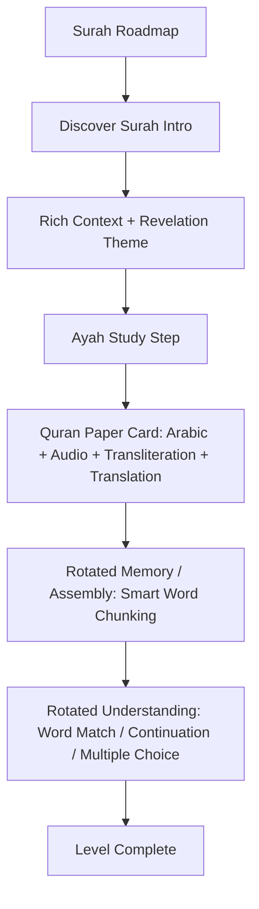

# Furqan — Next Phase Implementation Plan: Dynamic Exercises, Rich Surah Context & Token Chunking

## 1. Goal Description

Now that the critical preview loading issue has been resolved and the unified **Quran Paper Ayah Study** interface is live, this next phase focuses on transforming the learning experience from repetitive drills to an engaging, varied, mobile-optimized curriculum across all Surahs (105–114).

### Key Objectives
1. **Dynamic Exercise Rotation (P1-2)**: Replace monotonic single-type translation matching with an intelligent rotation among `multiple_choice`, `choose_continuation`, `match_word_meaning`, and `fill_gap`.
2. **Long Ayah Token Chunking (P2-3)**: For longer ayat (more than 6 tokens), group word tokens into 2–3 word semantic phrases for token ordering so mobile drag-and-drop stays calm and manageable.
3. **Surah Introductions with Rich Context (P2-1)**: Enhance the introduction level for each Surah by adding historical context, occasion of revelation, and thematic overview blocks.
4. **Study Player UX Polish**: Add playback speed options (1.0×, 0.75×) and ensure auto-playback starts smoothly upon entering the Study step.

---

## 2. User Review Required

> [!IMPORTANT]
> **Exercise Variety Strategy**: Each Ayah lesson will now rotate its required understanding practice step dynamically based on available data:
> - **If Word Meanings are available (≥ 2 tokens)**: Uses `match_word_meaning` (matching Arabic words to English definitions).
> - **If next Ayah exists in Surah**: Uses `choose_continuation` (identifying how the passage continues).
> - **Otherwise**: Uses `multiple_choice` translation match with curated plausible distractors from the same Surah.

> [!NOTE]
> All changes are schema-compliant and pass strict validation against Hafs 'an 'Asim canonical Quran rules.

---

## 3. Proposed Changes



---

### Component 1: Dynamic Exercise Engine & Importer (`packages/content-preview/src/importer.ts`)

#### [MODIFY] `packages/content-preview/src/importer.ts`
- Implement `buildRotatedUnderstandingActivity(ayah, surahAyat, locale, passageId, ...)`:
  - **Type A (`match_word_meaning`)**: Matches 2–4 selected words from the ayah to their English definitions when word meanings exist.
  - **Type B (`choose_continuation`)**: Given the current ayah (or first half), presents 3 options to choose the correct next phrase/ayah.
  - **Type C (`multiple_choice`)**: Clear translation identification with plausible options from adjacent ayat.
- Implement token chunking in `buildOrderAyahActivity`:
  - When `tokenIds.length > 6`, group consecutive tokens into 2–3 token chunks so learners order 3–4 chunks instead of 10+ individual tiny words.

---

### Component 2: Surah Introduction Context Enrichment (`packages/content-preview/src/importer.ts`)

#### [MODIFY] `packages/content-preview/src/importer.ts`
- Enrich the `surah_introduction` level for each Surah (105 to 114) with:
  - `surah_overview`: Core metadata (names, ayah count, Makkan/Madinan).
  - `context` block: Concise, source-backed summary of the theme, historical context (e.g. Year of the Elephant for Al-Fil, Day of Judgement for Al-Qari'ah).

---

### Component 3: Study Card & Audio Polish (`src/components/lesson/UnifiedAyahStudyRenderer.tsx` & `AyahAudioPlayer.tsx`)

#### [MODIFY] `src/components/lesson/AyahAudioPlayer.tsx`
- Add playback rate toggle (`1.0×` ↔ `0.75×`) for learners who want to listen at slower recitation speeds for memorization.
- Ensure audio autoplay triggers smoothly on mount when entering the step.

#### [MODIFY] `src/components/lesson/UnifiedAyahStudyRenderer.tsx`
- Refine font sizing and spacing for tablets and small mobile screens.
- Enhance tab animations and visual badges for draft annotations.

---

## 4. Verification Plan

### Automated Tests
```bash
# 1. Rebuild and validate preview packages for Surahs 105-114
npm run content:preview:build
npm run content:preview:validate

# 2. Run full Jest test suite (all 39 suites)
npm test

# 3. Verify TypeScript type safety
npm run typecheck
```

### Manual Verification
1. **Roadmap & Surahs**: Check that all 10 Surahs show enriched introduction cards.
2. **Ayah Lessons**: Verify that different ayat now present varied exercise types (word matching, continuation, and translation choice).
3. **Word Chunking**: Test an ayah with >6 words (e.g. Al-Fil Ayah 1) and confirm word chunks are easy to tap and reorder on mobile.
4. **Audio Speed**: Verify the 0.75× / 1.0× audio speed toggle plays Husary recitation smoothly.
